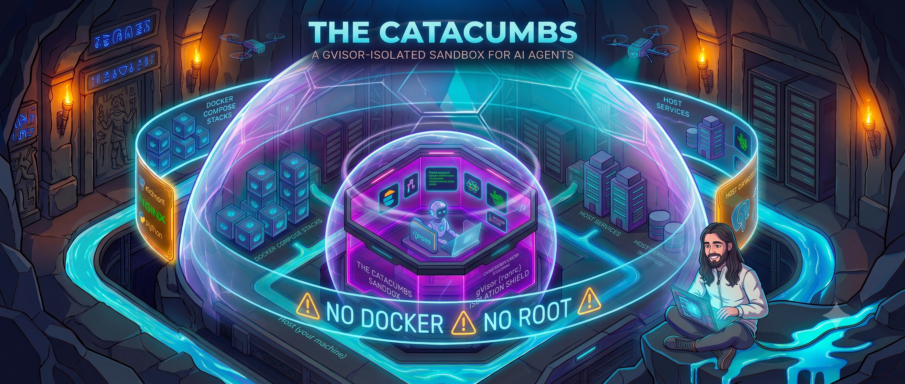

# The Catacombs



A gVisor-isolated agent sandbox for software development. Cursor agents run inside a hardened devcontainer with pre-installed tooling; Docker workloads and long-running services stay on the **host**.

## How it works

```
┌─────────────────────────────────────────────────────────────┐
│  Host (your machine)                                        │
│  Docker daemon · compose stacks · databases · dev services  │
│                                                             │
│  ┌───────────────────────────────────────────────────────┐  │
│  │  The Catacombs devcontainer (gVisor / runsc)          │  │
│  │  Cursor · agents · PHP · Node · Playwright · Serena   │  │
│  │  Workspace: /repos  ← bind-mount of host repos/       │  │
│  └───────────────────────────────────────────────────────┘  │
│         host.docker.internal ──► host-exposed ports         │
└─────────────────────────────────────────────────────────────┘
```

| Layer | Responsibility |
|-------|----------------|
| **Host** | Builds the devcontainer, runs Docker Compose, exposes services on localhost |
| **Sandbox** | Edits code in `repos/`, runs agents, executes tests and browser automation |
| **Bridge** | `host.docker.internal` — reach host services from inside the container |

The sandbox has **no Docker socket** and **no root**. If a task needs image builds or `docker compose`, run it on the host and tell the agent what you started.

## Repository layout

| Path | Role |
|------|------|
| `repos/` | Project workspaces — mounted as `/repos` inside the devcontainer |
| `.devcontainer/` | Image definition and devcontainer runtime (gVisor, resource limits, bind mounts) |
| `.agents/` / `.cursor/` | Agent skills, rules, and Cursor configuration |
| `skills-lock.json` | Locked agent skill packages (restored by `init.sh`) |
| `init.sh` | Host-side setup — run once before building the devcontainer |

Files at the repo root (`README.md`, `.devcontainer/`, etc.) are **not** inside the agent workspace. Inside the container, only `repos/` appears at `/repos`.

## Prerequisites (host)

Install on the machine that runs Docker and Cursor — **not** inside the devcontainer:

| Tool | Why |
|------|-----|
| [Docker](https://docs.docker.com/get-docker/) | Builds and runs the devcontainer |
| [Git](https://git-scm.com/) | Clone and submodule management |
| [Node.js](https://nodejs.org/) (npm) | `init.sh` restores agent skills via `npx skills` |
| [Cursor](https://cursor.com/) + Dev Containers | Open the sandbox |
| [uv](https://docs.astral.sh/uv/) (recommended) | Serena MCP server (`.cursor/mcp.json`) |

## Getting started

### 1. Clone

```bash
git clone git@github.com:ClownChu/the-catacombs.git
cd the-catacombs
```

### 2. Initialize on the host

Run before opening the devcontainer:

```bash
chmod +x init.sh
./init.sh
```

`init.sh` will:

- Verify Docker, Git, and Node.js are available
- Create required directories (`repos/`, `.devcontainer/home/.ssh/`, `.agents/skills/`)
- Link your host SSH key into `.devcontainer/home/.ssh/` for git inside the container
- Add `github.com` to `known_hosts`
- Initialize git submodules
- Restore agent skills from `skills-lock.json`

If no SSH key is found in `~/.ssh`, copy one manually:

```bash
cp ~/.ssh/id_ed25519 .devcontainer/home/.ssh/
chmod 600 .devcontainer/home/.ssh/id_ed25519
```

### 3. Add project workspaces

Clone or symlink your projects under `repos/`:

```bash
repos/
  my-app/
  another-service/
  shared-lib/
```

Inside the devcontainer these appear as `/repos/my-app/`, etc. Open individual projects from `/repos` in Cursor as needed.

### 4. Open the devcontainer

Open the repo in Cursor and run **Dev Containers: Reopen in Container**.

On first build the image is created from `.devcontainer/Dockerfile`. Bind mounts:

| Host path | Container path |
|-----------|----------------|
| `repos/` | `/repos` (workspace) |
| `.cursor/` | `/home/agent/.cursor` (writable — rules, MCP, settings) |
| `.devcontainer/home/.cursor/hooks` | `/home/agent/.cursor/hooks` (read-only overlay) |
| `.devcontainer/home/.cursor/hooks.json` | `/home/agent/.cursor/hooks.json` (read-only overlay) |
| `.devcontainer/home/.cursor/catacombs-security` | `/home/agent/.cursor/catacombs-security` (read-only overlay) |
| `.devcontainer/home/.cursor/catacombs-security.json` | `/home/agent/.cursor/catacombs-security.json` (read-only overlay) |
| `.agents/` | `/home/agent/.agents` |
| `.devcontainer/home/.ssh/` | `/home/agent/.ssh` |
| `skills-lock.json` | `/home/agent/.skills-lock.json` |

After the container is created, `postCreateCommand` tightens SSH key permissions and loads the key into an agent, installs Playwright browsers (`npm install -g playwright && npx playwright install`), clears the git identity placeholders, and symlinks `.cursor/rules` into `/repos/.cursor/rules`.

## Inside the sandbox

### User and limits

- Non-root user `agent` (uid 1000)
- **6 GB RAM**, **4 CPUs**
- gVisor (`runsc`) — stricter syscall sandbox than a normal container

### Pre-installed tooling

| Category | Tools |
|----------|-------|
| Languages | PHP 5.6 / 7.4 / 8.1 / 8.5 (default `php` → 8.5), Node 22.12.0 (nvm in the image) plus LTS (devcontainer feature), Python 3.11 |
| Package managers | Composer, npm, `uv`, `pipx` |
| Automation | Playwright (OS deps in the image; browsers installed at container create) |
| CLI | `gh`, PostgreSQL client (`psql`), MariaDB/MySQL client (`mysql`), SQLite (`sqlite3`) |
| MCP | Serena (PHP symbol navigation via `.cursor/mcp.json`) |

Invoke a specific PHP version explicitly when needed (e.g. `php7.4`), rather than relying on the default.

System packages are baked into the image at build time. To add packages, update `.devcontainer/Dockerfile` and rebuild the devcontainer — `apt install` inside the running container does not persist.

### Networking

Services on the host are **not** reachable at `localhost` from inside the devcontainer.

```bash
# Wrong — points to the container itself
curl http://localhost:8080

# Correct — reaches a service on the host
curl http://host.docker.internal:8080
```

Use `host.docker.internal` for any host-exposed HTTP/HTTPS endpoint, including databases reached via host Docker ports.

### Databases

No database **server** runs inside the sandbox. PostgreSQL, MySQL/MariaDB, and other databases run on the host via Docker; connect with `host.docker.internal` and the port your compose stack exposes. **Clients** for PostgreSQL (`psql`), MariaDB/MySQL (`mysql`), and SQLite (`sqlite3`) are pre-installed in the container.

## Security guard

Cursor hooks enforce a **profile-driven security guard** on agent actions. Canonical guard sources live under **`.devcontainer/home/.cursor/`** and are overlay-mounted read-only into `/home/agent/.cursor/` (hooks, `hooks.json`, `catacombs-security/`, `catacombs-security.json`). The rest of `.cursor/` (rules, MCP, settings) stays writable via the general bind mount.

Agents **may** edit `.cursor/` except the four guard artifacts above. They **cannot read or write** `hooks.json`, `hooks/`, `catacombs-security.json`, or `catacombs-security/` — blocked at every profile with user notification. Files under `.ssh/` cannot be read or modified except **reading** `*.pub` keys.

### Profiles

| Profile | Summary |
|---------|---------|
| `low` | Ask before most actions; hard-block guard policy, container escape, writes outside `/repos` |
| `medium` (default) | Same ask-default model as low |
| `high` | Blocks network egress, HTTP tools, credential access, destructive commands |
| `extreme` | High + asks before subagent spawn |
| `you-shall-not-pass` | Blocks subagents and writes outside `/repos` |

Select the active profile in `.devcontainer/home/.cursor/catacombs-security.json` (overlay-mounted at `~/.cursor/catacombs-security.json`):

```json
{
  "version": 1,
  "active_profile": "medium",
  "overrides": {}
}
```

Per-category overrides (`action`: `block` | `ask` | `allow`; `notify`: `true`) merge on top of the profile without editing profile files.

### `.env` and secret values

The `secret_values` category is **enabled at every level**. On `low`/`medium`, shell access to secrets is **ask**; direct file reads (`beforeReadFile`, `Read`/`Grep`) are **denied** because Cursor cannot prompt on those hooks. On `high` and above, secret access is blocked outright. Violations emit `user_message` + `agent_message` (blocks) and an audit line to `~/.cursor/catacombs-security-audit.log` (names/paths only — never values).

### Hook vs kernel layers

| Layer | Role |
|-------|------|
| **IDE hooks** (shipped) | Path-aware rules, `.env` blocking, ask/block UX, audit log — `hooks.json` resolves `catacombs-hook.sh` from `.cursor/hooks/` first, then `~/.cursor/hooks/` |
| **gVisor + seccomp** (optional) | Syscall reduction — gVisor already enabled; seccomp documented in [security-recommendations](docs/security-recommendations.md) |
| **Host egress firewall** (optional) | Network deny/allowlist on the Docker bridge |

Hooks are the primary enforcement layer; kernel/host hardening is complementary. See [docs/security-recommendations.md](docs/security-recommendations.md) for optional complements and read-only mount guidance.

### Run guard tests

Run from the **host** (agents cannot read the hooks directory):

```bash
python3 -m unittest discover -s .devcontainer/home/.cursor/hooks -p 'test_*.py' -v
```

Rebuild the devcontainer after mount changes.

## Agent tooling

Cursor agents in this sandbox follow rules in `.cursor/rules/`:

| Rule | Purpose |
|------|---------|
| `catacombs.mdc` | Environment constraints (no Docker in sandbox, networking, resource limits) |
| `ponytail.mdc` | Minimal-diff coding style |
| `serena-use.mdc` | Serena MCP for PHP symbol navigation and edits |
| `ironbee-devtools-use.mdc` | Browser verification via IronBee DevTools |

Agent skills are locked in `skills-lock.json` and installed to `.agents/skills/` by `init.sh`.

### Cursor auto-run (optional)

By default, `cursor.chat.autoRun` is **`false`** in `.devcontainer/devcontainer.json` — the agent asks before running shell commands.

To enable unattended command execution (faster iteration, less per-step control), set:

```json
"settings": {
  "cursor.chat.autoRun": true
}
```

in `.devcontainer/devcontainer.json` (under `customizations.vscode.settings`) or in Cursor user/workspace settings, then rebuild or reopen the devcontainer. See [KV-09](docs/known-vulnerabilities.md) for the security trade-off when opting in.

## Environment variables

| Variable | Value | Purpose |
|----------|-------|---------|
| `CATACOMBS` | `1` | Marks the catacombs sandbox |

## Known vulnerabilities

The sandbox limits Docker and root access, but an agent still has **intentional reach** into parts of the host via bind mounts and networking. Treat agent sessions like semi-trusted shell access, not a fully isolated VM.

| Risk | Summary |
|------|---------|
| **Bind mounts** | `repos/`, `.cursor/`, `.agents/`, and `.ssh/` are read-write on the host — no container escape needed |
| **SSH keys** | The mounted private key can push to repos and `ssh` to remote hosts |
| **Host services** | `host.docker.internal` reaches databases and APIs exposed on the host |
| **Persistence** | Agents can modify rules, skills, and MCP config for future sessions; guard hooks/config are read-only overlays |

The container runs with Docker's **default capability set** (no `--cap-add=all`) under gVisor.

Full write-up and mitigations:

- [docs/known-vulnerabilities.md](docs/known-vulnerabilities.md) — threat catalog (KV-01 … KV-09)
- [docs/security-recommendations.md](docs/security-recommendations.md) — how to address each vulnerability

## Further reading

- `.cursor/rules/catacombs.mdc` — full environment rules for agents
- `.cursor/rules/serena-use.mdc` — Serena MCP usage
- `.cursor/rules/ironbee-devtools-use.mdc` — IronBee DevTools browser verification
