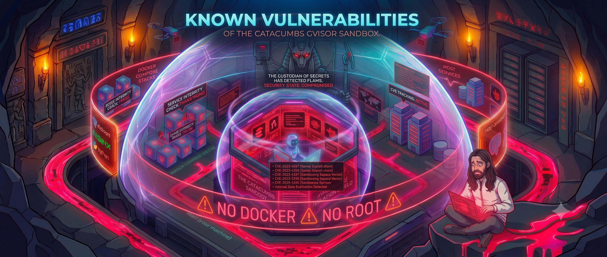

# Known vulnerabilities

Threat model for **The Catacombs**: a Cursor agent runs with shell access inside a gVisor devcontainer. The goal is to limit blast radius on the host and on connected systems, while still allowing productive development. This document lists known weaknesses in the current design — not theoretical zero-days, but realistic paths a misbehaving or compromised agent could take today.

## Summary

| ID | Vulnerability | Severity | Escape required? |
|----|---------------|----------|------------------|
| [KV-01](#kv-01-host-filesystem-via-bind-mounts) | Host filesystem access via bind mounts | High | No |
| [KV-02](#kv-02-ssh-private-key-exposure) | SSH private key exposure | Critical | No |
| [KV-03](#kv-03-host-network-via-hostdockerinternal) | Host network access via `host.docker.internal` | High | No |
| [KV-04](#kv-04-agent-config-persistence) | Agent config persistence (rules, skills, MCP) | Medium | No |
| [KV-05](#kv-05-symlink-traversal-under-repos) | Symlink traversal under `repos/` | Medium | No |
| [KV-06](#kv-06-broad-linux-capabilities) | Broad Linux capabilities (`--cap-add=all`) | Low (mitigated) | Yes (kernel/gVisor) |
| [KV-07](#kv-07-unrestricted-outbound-network) | Unrestricted outbound network | Medium | No |
| [KV-08](#kv-08-remote-repo-and-api-access) | Remote repo and API access (`git`, `gh`, `npm`) | Medium | No |
| [KV-09](#kv-09-auto-run-agent-commands) | Auto-run agent commands (opt-in) | Low–Medium | No |

See [security-recommendations.md](./security-recommendations.md) for mitigations.

---

## KV-01: Host filesystem via bind mounts

**Severity:** High  
**Container escape required:** No

Several host directories are bind-mounted read-write into the container. Any file operation the agent performs at the matching container path writes directly to the host.

| Host path | Container path | Risk |
|-----------|----------------|------|
| `repos/` | `/repos` | Read/write all project workspaces on the host |
| `.cursor/` | `/home/agent/.cursor` | Modify rules, MCP config, Cursor settings |
| `.agents/` | `/home/agent/.agents` | Modify or add agent skills |
| `.devcontainer/home/.ssh/` | `/home/agent/.ssh` | Read/use SSH keys; modify `known_hosts` |
| `skills-lock.json` | `/home/agent/.skills-lock.json` | Alter skill lockfile |

Repo-root files such as `README.md`, `init.sh`, and `.devcontainer/Dockerfile` are **not** mounted and are outside direct reach — unless another vector (symlinks, remote push, host services) exposes them.

**Impact:** Data loss, credential planting, policy bypass, supply-chain changes to future agent runs.

---

## KV-02: SSH private key exposure

**Severity:** Critical  
**Container escape required:** No

`init.sh` links the host SSH private key into `.devcontainer/home/.ssh/`, which is mounted at `/home/agent/.ssh`. The agent can:

- Clone, push, and force-push to any repository the key authorizes
- `ssh` into any host that trusts the key
- Use deploy keys or org-wide access beyond the current workspace

**Impact:** Remote code execution on servers, repository takeover, lateral movement to production systems. If the same key is used for host SSH, loopback access may reach the host itself.

---

## KV-03: Host network via `host.docker.internal`

**Severity:** High  
**Container escape required:** No

`devcontainer.json` adds `host.docker.internal:host-gateway`. The agent cannot reach host services at `localhost` inside the container, but **can** reach anything the host exposes on its interfaces via `host.docker.internal:<port>`.

Typical targets:

- Databases (PostgreSQL, MySQL, Redis) bound to `0.0.0.0` or published Docker ports
- Dev servers and admin UIs (APIs, debug endpoints, phpMyAdmin, etc.)
- Internal services mistakenly exposed on the LAN

**Impact:** Read/modify production or dev data, trigger host-side file writes through application APIs, exploit unauthenticated admin endpoints.

---

## KV-04: Agent config persistence

**Severity:** Medium  
**Container escape required:** No

Because `.cursor/` (rules, MCP, settings) and `.agents/` are mounted writable, an agent can persist changes that affect **future** sessions:

- Weaken or remove safety rules in `.cursor/rules/` (except guard hooks/config — those are read-only overlays from `.devcontainer/home/.cursor/`)
- Add malicious MCP server entries in `.cursor/mcp.json`
- Install or alter skills under `.agents/skills/`

Guard artifacts (`hooks.json`, `hooks/`, `catacombs-security.json`, `catacombs-security/`) are overlay-mounted read-only and blocked from agent read/write by hooks at every profile.

**Impact:** Long-lived compromise without repeating the initial prompt; gradual policy erosion that may not be obvious in a diff review.

---

## KV-05: Symlink traversal under `repos/`

**Severity:** Medium  
**Container escape required:** No

Workspaces live under `repos/`, but symlinks inside that tree are not confined. A symlink such as `repos/evil -> ../../.ssh` or `repos/foo -> /home/user/Documents` may cause tools (editors, `cp`, `rm`, build scripts) to read or write paths outside the intended workspace boundary.

**Impact:** Access to host files not otherwise mounted into the container.

---

## KV-06: Broad Linux capabilities

**Severity:** Low (mitigated)  
**Container escape required:** Yes (kernel / gVisor boundary)

`--cap-add=all` has been **removed** from `devcontainer.json` `runArgs`. The container now runs with Docker's default capability set, so the agent no longer holds every Linux capability.

Residual risk is limited to the default capabilities, still filtered by gVisor (`runsc`) — a much smaller surface than before. Re-adding broad capabilities would restore the original exposure.

**Impact:** Low today; a gVisor or kernel vulnerability reachable from default capabilities would be required, and bind mounts and SSH already provide wider access by simpler means.

---

## KV-07: Unrestricted outbound network

**Severity:** Medium  
**Container escape required:** No

There is no egress firewall. The agent can reach the public internet for package installs, exfiltration, command-and-control, or fetching malicious skill packages.

**Impact:** Data exfiltration (source code, env files, keys found in `repos/`), download of second-stage payloads.

---

## KV-08: Remote repo and API access

**Severity:** Medium  
**Container escape required:** No

Pre-installed tooling includes `git`, `gh`, `npm`, `npx`, `composer`, `pipx`, `uv`, `curl`, `wget`, the MariaDB/MySQL, PostgreSQL, and SQLite clients, and Playwright. Combined with network access and (often) SSH or `gh` auth, an agent can push code, open PRs, publish packages, or interact with third-party APIs using credentials available in the environment or mounted keys.

**Impact:** Supply-chain attacks, unauthorized releases, social-engineering via PRs opened in the agent's name.

---

## KV-09: Auto-run agent commands

**Severity:** Low–Medium  
**Container escape required:** No

`devcontainer.json` defaults to `"cursor.chat.autoRun": false`, so the agent asks before running shell commands. If you opt in with `"cursor.chat.autoRun": true` (in `devcontainer.json` or Cursor settings), the agent may execute shell commands without per-step user approval.

**Impact:** When enabled, faster exploitation of any other vulnerability listed here; mistakes cause immediate filesystem or network effects rather than pausing for review.

---

## What is *not* a known gap

These controls are in place and working as designed:

- **No Docker socket** — the agent cannot start or control host containers.
- **Non-root user** (`agent`, uid 1000) — no direct host root inside the container namespace.
- **gVisor (`runsc`)** — syscall sandboxing beyond a typical devcontainer.
- **Default capabilities only** — no `--cap-add=all` in `runArgs` (see [KV-06](#kv-06-broad-linux-capabilities)).
- **Resource limits** — 6 GB RAM, 4 CPUs (DoS containment, not secrecy).

---

## Reporting

If you discover an additional vulnerability or a practical exploit chain, document it here and add a matching recommendation in [security-recommendations.md](./security-recommendations.md).
