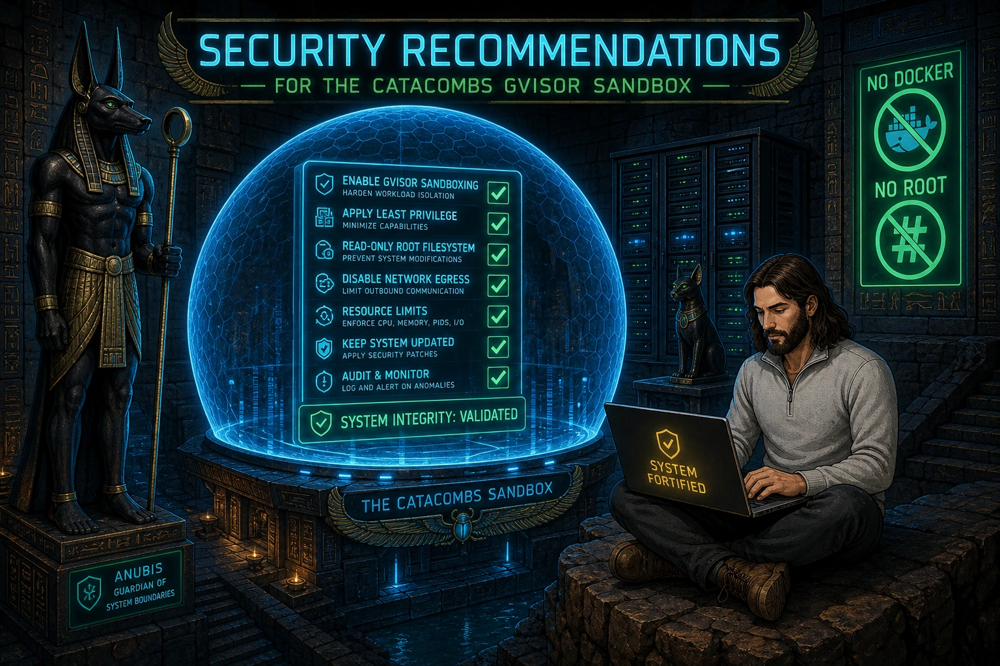

# Security recommendations



Mitigations for the vulnerabilities documented in [known-vulnerabilities.md](./known-vulnerabilities.md). Ordered by impact; implement the **Critical** and **High** items before trusting the sandbox with sensitive keys or production-adjacent services.

---

## Quick priority matrix

| Priority | IDs | Theme |
|----------|-----|-------|
| **P0 — do first** | KV-02, KV-03 | Keys and host services |
| **P1 — high value** | KV-01, KV-04, KV-05 | Mount scope and persistence |
| **P2 — harden** | KV-07, KV-08, KV-09 | Egress, tooling, auto-run |
| **Mitigated** | KV-06 | Capabilities — `--cap-add=all` already removed |

---

## Guard profile resolution matrix

Each vulnerability maps to a **minimum guard profile** for hook-level mitigation, plus **residual host steps** when hooks alone are insufficient. Full KV details: [known-vulnerabilities.md](./known-vulnerabilities.md).

| ID | `low` | `medium` | `high` | `extreme` | `you-shall-not-pass` | Still needs host/infra |
|----|-------|----------|--------|-----------|----------------------|------------------------|
| KV-01 | Ask on sensitive reads; block writes outside `/repos` | Same as low | Block creds + re-enabled write guard | Same as high | **Block reads outside `/repos`** | Narrow `repos/` mount; dedicated VM |
| KV-02 | Ask SSH/creds | Ask | Block | Block | Block | Scoped deploy key; read-only `.ssh` mount |
| KV-03 | Ask network | Ask | Block HTTP tools + expanded egress | Block | **Block all matched egress incl. DB clients** | Host firewall; drop `host.docker.internal` |
| KV-04 | Ask on agent config writes | Ask | Block agent config | Block | Block | Read-only `.cursor/rules` mount; branch protection |
| KV-05 | Ask `ln -s` | Ask | Ask | Ask | **Block symlink shell** | `find repos/ -type l`; no escaping symlinks |
| KV-06 | — | — | — | — | — | Keep gVisor; no `--cap-add=all` |
| KV-07 | Ask | Ask | Block | Block | Block | Optional egress firewall (Layer 3) |
| KV-08 | Ask git remote | Ask | Block expanded git/gh | Block | Block | Scoped PAT/deploy key; branch protection |
| KV-09 | — | — | — | — | — | Keep `cursor.chat.autoRun: false` |

**Honest residual at `you-shall-not-pass`** (hooks cannot claim full VM isolation):

- Read/write anywhere under `/repos/` (by design)
- Existing symlink targets already on disk (host audit)
- `cursor.chat.autoRun: true` if user opts in
- Programmatic network bypass (`python -c` / `node -e` with sockets) — documented hook ceiling; blocking all interpreted `-c`/`-e` would break normal dev

---

## KV-02: SSH private key exposure

**Minimum guard profile:** `high` (blocks `ssh_dir`, `credential_access`, shell `ssh` via `network_egress`). Full hook coverage: same.

### Recommendations

1. **Use a dedicated deploy key per repo** (read-only when possible) instead of your personal `id_ed25519`. Generate on the host:
   ```bash
   ssh-keygen -t ed25519 -f .devcontainer/home/.ssh/id_ed25519_github -C "catacombs-agent"
   ```
   Add the public key to a single GitHub repo with **read-only** access.

2. **Never mount your primary SSH key.** Do not symlink `~/.ssh/id_ed25519` via `init.sh` for high-trust setups; copy or generate a limited key instead.

3. **Mount `.ssh` read-only** in `devcontainer.json`:
   ```json
   "source=${localWorkspaceFolder}/.devcontainer/home/.ssh,target=/home/agent/.ssh,type=bind,readonly"
   ```
   Note: read-only prevents the agent from altering `known_hosts` but still allows **using** the private key. Combine with a scoped key.

4. **Use HTTPS + credential helper with a fine-grained PAT** instead of SSH when you need write access with revocable, repo-scoped tokens.

5. **Rotate keys** if you suspect an agent run was malicious or ran untrusted prompts.

---

## KV-03: Host network via `host.docker.internal`

**Minimum guard profile:** `you-shall-not-pass` (blocks `host.docker.internal`, DB clients, `git` remote ops). `high` blocks common HTTP/package egress but not all DB paths.

### Recommendations

1. **Bind host services to `127.0.0.1` only** where possible. `host.docker.internal` resolves to the host gateway; services listening only on localhost may still be reachable depending on Docker networking — treat published ports as agent-accessible.

2. **Do not publish sensitive databases to `0.0.0.0`.** Use Docker networks that are not bridged to the devcontainer, or firewall the host port so only true localhost can connect (knowing Docker may bypass naive localhost-only assumptions).

3. **Run dev databases in isolated compose projects** with strong passwords and no default credentials. Assume the agent can attempt connections.

4. **Remove `host.docker.internal` when not needed** by dropping `--add-host=host.docker.internal:host-gateway` from `runArgs`. Agents then cannot reach host services by that hostname (may break workflows that depend on it).

5. **Use a host firewall** (e.g. `ufw`, `nftables`) to deny the Docker bridge subnet access to sensitive host ports.

---

## KV-01: Host filesystem via bind mounts

**Minimum guard profile:** `you-shall-not-pass` (`file_read_outside_repos`). Writes outside `/repos` blocked at every profile via `file_write_outside_repos`.

### Recommendations

1. **Keep only intended projects under `repos/`.** Do not symlink your entire home directory or secrets into `repos/`.

2. **Split sensitive config from mounted paths:**
   - Keep production secrets out of `repos/` entirely (use host-only env files, secret managers).
   - Consider mounting `.cursor/rules` read-only if agents should not rewrite policy:
     ```json
     "source=${localWorkspaceFolder}/.cursor/rules,target=/home/agent/.cursor/rules,type=bind,readonly"
     ```

3. **Version-control and review changes** to `.cursor/`, `.agents/`, and `skills-lock.json` the same as application code. After agent sessions, run `git diff` on the catacombs root.

4. **Use a dedicated catacombs clone** on a machine or user account that does not hold unrelated personal files.

5. **Optional: narrow workspace mount** to a single project directory instead of all of `repos/` when working on one module.

---

## KV-04: Agent config persistence

**Minimum guard profile:** `high` (`agent_config` blocks writes to rules, MCP, settings, `.agents/`, `skills-lock.json`). At `low`/`medium`, shell edits ask; IDE writes deny (no ask on `preToolUse`).

### Recommendations

1. **Mount `.cursor/rules` read-only** (see KV-01). Allow writes only to project code under `repos/`, not policy files.

2. **Pin and audit MCP config** (`.cursor/mcp.json`). Reject agent-proposed changes that add unknown MCP servers or broaden tool access.

3. **Treat `skills-lock.json` changes as security-relevant.** Review before running `npx skills experimental_install` on the host.

4. **Add a post-session hook or checklist** to diff `.cursor/` and `.agents/` before committing.

5. **Use branch protection** on the catacombs repo so agent-modified rules cannot merge without human review.

---

## KV-05: Symlink traversal under `repos/`

**Minimum guard profile:** `you-shall-not-pass` (`symlink_escape` blocks shell `ln -s`). Lower profiles ask before symlink creation.

### Recommendations

1. **Audit `repos/` for symlinks** before opening the devcontainer:
   ```bash
   find repos/ -type l -ls
   ```

2. **Refuse symlinks that escape `repos/`** in your onboarding docs or a small host-side check in `init.sh`.

3. **Clone repos directly** into `repos/<name>/` instead of symlinking arbitrary host paths.

4. **Enable `core.protectNTFS` / avoid following symlinks in tooling** where supported (editor-specific; not a full fix).

---

## KV-06: Broad Linux capabilities

### Recommendations

1. **Remove `--cap-add=all`** from `devcontainer.json` `runArgs` — **already done by default**; the current config ships with Docker's default capability set.

2. **Do not re-add broad capabilities.** If a specific cap is required, add only that one (typical dev work needs none).

3. **Keep gVisor enabled** (`--runtime=runsc`). Do not switch to `runc` for convenience without accepting a larger escape surface.

4. **Keep the image updated** — rebuild the devcontainer when the base image or gVisor runtime is patched.

---

## Catacombs security guard (IDE hooks)

**Layer 1** enforcement ships with the repo; hooks are a no-op unless the root-owned image sentinel `/etc/catacombs-container` exists. Canonical sources live under **`.devcontainer/home/.cursor/`** and are overlay-mounted read-only onto `~/.cursor/` for hooks and security config. `hooks.json` resolves `catacombs-hook.sh` from **`.cursor/hooks/`** (workspace-relative) first, then **`~/.cursor/hooks/`**; the entrypoint `exec`s `catacombs_guard.py` with `guard` or `audit`. Missing scripts fail closed. The guard loads the active profile from `catacombs-security.json`, level files from `catacombs-security/profiles/`, and shared patterns from `catacombs-security/categories.json`.

| Hook | Purpose |
|------|---------|
| `beforeShellExecution` | Command patterns, `.env`, sensitive env vars |
| `beforeMCPExecution` | MCP network tools |
| `preToolUse` | WebFetch, WebSearch, Read/Grep on sensitive paths |
| `beforeReadFile` | Direct file reads (path only — content never logged) |
| `postToolUse` / `afterShellExecution` | Audit successful reads; warn on secret leakage |

All pre-execution hooks use `failClosed: true`. Default profile: **medium**. On `low`/`medium`, matched shell and MCP categories **ask** (classifier-gated — not every command); `guard_policy`, `container_escape`, and `file_write_outside_repos` **block + notify** at every level. Every `action: block` notifies the user with operation, target, and inferred intention.

### Profiles

| Profile | Summary |
|---------|---------|
| `low` | Ask before most shell actions; hard-block guard policy, container escape, writes outside `/repos`; ask on agent config writes (shell) and symlinks |
| `medium` (default) | Same ask-default model as `low`; shell/MCP ask only when a category classifier matches |
| `high` | Blocks network egress, HTTP tools, credentials, secrets, destructive commands, and **agent config writes**; re-enabled `file_write_outside_repos` |
| `extreme` | Same blocks as `high`; asks before subagent spawn |
| `you-shall-not-pass` | Maximum hook enforcement: blocks network (incl. DB clients, `git`/`gh`), subagents, agent config, reads outside `/repos`, symlink creation, writes outside `/repos` |

Select profile in `.devcontainer/home/.cursor/catacombs-security.json` (`active_profile`). See the [guard profile resolution matrix](#guard-profile-resolution-matrix) for per-KV mapping.

### Categories (selected)

| Category | Matcher | Guards |
|----------|---------|--------|
| `guard_policy` | path | Hooks, `catacombs-security.json`, profiles — block at every level |
| `agent_config` | path | `.agents/`, `.cursor/rules/`, `mcp.json`, `settings.json`, `skills-lock.json` |
| `file_read_outside_repos` | read_prefix | Reads outside `/repos/` — `you-shall-not-pass` only |
| `file_write_outside_repos` | write_prefix | Writes outside `/repos/` — all profiles |
| `symlink_escape` | shell_regex | Shell `ln -s` — block at `you-shall-not-pass` |
| `network_egress` | shell_regex | `curl`, `wget`, `ssh`, package managers, `host.docker.internal`, DB clients, `git push`/`pull`/`fetch`, `gh` |
| `secret_values` | secrets | `.env` files, sensitive env vars — deny reads at all levels |

**`you-shall-not-pass` = maximum hook enforcement.** Residual gaps (workspace access under `/repos/`, programmatic sockets, existing symlinks, `autoRun`) are listed in the [matrix above](#guard-profile-resolution-matrix).

### Read-only overlay mounts (recommended)

Guard config is shipped read-only via overlay mounts in `devcontainer.json` (after the writable `.cursor` bind):

```json
"source=${localWorkspaceFolder}/.devcontainer/home/.cursor/hooks,target=/home/agent/.cursor/hooks,type=bind,readonly",
"source=${localWorkspaceFolder}/.devcontainer/home/.cursor/hooks.json,target=/home/agent/.cursor/hooks.json,type=bind,readonly",
"source=${localWorkspaceFolder}/.devcontainer/home/.cursor/catacombs-security,target=/home/agent/.cursor/catacombs-security,type=bind,readonly",
"source=${localWorkspaceFolder}/.devcontainer/home/.cursor/catacombs-security.json,target=/home/agent/.cursor/catacombs-security.json,type=bind,readonly"
```

Agents may still edit `.cursor/rules`, `.cursor/mcp.json`, and `.agents/` unless `agent_config` is enabled at `high`+ or the paths are mounted read-only on the host.

### Tests

Run from the **host** (agents cannot read the hooks directory):

```bash
python3 -m unittest discover -s .devcontainer/home/.cursor/hooks -p 'test_*.py' -v
```

GitHub Actions runs the same command on pull requests.

Rebuild the devcontainer after mount changes.

---

## Kernel and container complements (optional — Layer 2/3)

Hooks handle path-aware rules (`.env`, credential paths, ask/block UX). Kernel and host layers add syscall reduction and egress control — **complementary, not interchangeable**.

| Layer | What it blocks | Status in catacombs |
|-------|----------------|---------------------|
| **gVisor (`runsc`)** | Syscall surface reduction | **Enabled** in `devcontainer.json` `runArgs` |
| **Docker seccomp profile** | Dangerous syscalls (`mount`, `ptrace`, `reboot`, …) | Documented optional follow-up |
| **Host egress firewall** | Outbound TCP/UDP from container bridge | Documented optional follow-up |
| **Capability dropping** | Privileged caps | Default Docker set (no `--cap-add=all`) |
| **Read-only bind mounts** | Policy / hook directories | Recommended above |

### What kernel layers cannot do here

| Goal | Why it fails |
|------|--------------|
| Block reads of `**/.env` under `/repos/` | Bind-mounted workspace is owned by agent uid; no per-path LSM without root-owned overlay |
| Block agent IDE Read tool | Kernel sees the Cursor process, not individual tool calls |
| In-container `iptables` | Agent has no root / `CAP_NET_ADMIN`; gVisor may restrict anyway |

### Optional seccomp profile (host-maintained)

Add to `devcontainer.json` `runArgs` when you maintain a seccomp JSON on the host:

```json
"--security-opt", "seccomp=${localWorkspaceFolder}/.devcontainer/seccomp-profile.json"
```

Example policy shape (trim to your threat model):

```json
{
  "defaultAction": "SCMP_ACT_ERRNO",
  "architectures": ["SCMP_ARCH_X86_64", "SCMP_ARCH_X86", "SCMP_ARCH_X86_64"],
  "syscalls": [
    { "names": ["read", "write", "open", "close", "stat", "fstat", "mmap", "mprotect", "munmap", "brk", "rt_sigaction", "rt_sigprocmask", "ioctl", "access", "pipe", "select", "sched_yield", "mremap", "msync", "mincore", "madvise", "dup", "dup2", "pause", "nanosleep", "getpid", "socket", "connect", "accept", "sendto", "recvfrom", "clone", "fork", "vfork", "execve", "exit", "wait4", "kill", "uname", "fcntl", "flock", "fsync", "fdatasync", "truncate", "ftruncate", "getdents", "getcwd", "chdir", "fchdir", "rename", "mkdir", "rmdir", "creat", "link", "unlink", "readlink", "chmod", "fchmod", "chown", "fchown", "lchown", "umask", "gettimeofday", "getrlimit", "getrusage", "sysinfo", "times", "getuid", "getgid", "geteuid", "getegid", "getppid", "getpgrp", "setsid", "setpgid", "getgroups", "setgroups", "setuid", "setgid", "getresuid", "getresgid", "getpgid", "setreuid", "setregid", "gettid", "exit_group", "tkill", "futex", "set_tid_address", "set_robust_list", "nanosleep", "epoll_create", "epoll_ctl", "epoll_wait", "setitimer", "getitimer", "timer_create", "timer_settime", "timer_gettime", "timer_delete", "clock_gettime", "clock_getres", "clock_nanosleep", "prctl", "arch_prctl", "set_tid_address"], "action": "SCMP_ACT_ALLOW" }
  ]
}
```

v1 ships hooks only; seccomp is an optional host follow-up (rebuild devcontainer after adding the profile).

### Optional host egress firewall (KV-07)

Block container bridge egress except allowlisted destinations. Example with `nftables` on the host (adjust `br-*` to your Docker bridge):

```bash
# Inspect bridge subnet
docker network inspect bridge | jq '.[0].IPAM.Config'

# Example: deny all egress from 172.17.0.0/16 except DNS and HTTPS to specific CIDR
sudo nft add table ip catacombs
sudo nft 'add chain ip catacombs forward { type filter hook forward priority 0; policy accept; }'
sudo nft add rule ip catacombs forward ip saddr 172.17.0.0/16 ip daddr != 172.17.0.0/16 drop
```

Narrower allowlists (npm, MCP endpoints) require maintenance; hooks remain the primary network policy UX (`network_egress` category).

### Recommended layered model

```
Layer 1 (IDE):       Cursor hooks     — path rules, .env, ask/block UX, audit log  [shipped]
Layer 2 (container): gVisor + seccomp — syscall reduction                         [gVisor on; seccomp optional]
Layer 3 (host):      egress firewall  — network deny/allowlist                    [optional]
```

---

## KV-07: Unrestricted outbound network

**Minimum guard profile:** `high` (`network_egress`, `http_tools`). Full DB/git/gh coverage: `you-shall-not-pass`.

### Recommendations

1. **Use the security guard** — set `active_profile` to `high` for broad egress blocks, or `you-shall-not-pass` for maximum hook coverage (see [matrix](#guard-profile-resolution-matrix)).

2. **Run on an isolated network** (VM, cloud dev box) without access to production VPCs.

3. **Use Docker user-defined networks with egress restrictions** or a host firewall blocking container egress except allowlisted domains (advanced; may break npm, MCP, etc.). See **Kernel and container complements** above.

4. **Do not store secrets in `repos/`** — assume exfiltration is possible.

5. **Review agent network activity** in logs when debugging suspicious behavior.

---

## KV-08: Remote repo and API access

**Minimum guard profile:** `you-shall-not-pass` (blocks `git push`/`pull`/`fetch`, broad `gh`). `high` blocks package managers and HTTP tools.

### Recommendations

1. **Scope credentials:** read-only deploy keys, fine-grained GitHub PATs, separate `gh auth` tokens with minimal scopes.

2. **Disable or remove `gh`** from the image if not required for your workflow.

3. **Use GitHub branch protection and required reviews** so agent pushes cannot merge without humans.

4. **Pin dependencies** and avoid blind `npm install` / `npx` of unaudited packages in agent-driven sessions.

5. **Consider a dedicated bot GitHub account** for agent operations, not tied to a human's full org access.

---

## KV-09: Auto-run agent commands

**Minimum guard profile:** N/A — not governed by hooks. Keep `cursor.chat.autoRun: false`.

### Recommendations

1. **Keep the default** — `"cursor.chat.autoRun": false` in `devcontainer.json` is the safe baseline; the agent prompts before each shell command.

2. **Opt in only for trusted workflows** — set `"cursor.chat.autoRun": true` when you want unattended command execution and mounts/keys are already limited per KV-01 and KV-02:
   ```json
   "cursor.chat.autoRun": true
   ```

3. **Prefer plan/review mode** for destructive operations (migrations, mass deletes, force-push).

---

## Hardened profile (checklist)

A practical “safer catacombs” setup:

- [ ] Dedicated read-only or single-repo SSH deploy key in `.devcontainer/home/.ssh/`
- [ ] `.ssh` mount marked `readonly` where compatible
- [ ] `.cursor/rules` mounted read-only
- [ ] No symlinks escaping `repos/`
- [ ] Host DBs and admin UIs not exposed on bridge-accessible ports
- [x] `--cap-add=all` removed from `runArgs` (already the default)
- [ ] `cursor.chat.autoRun` left disabled (default) or only enabled for trusted sessions
- [ ] Security guard profile set — `medium` (default), `high`, or `you-shall-not-pass` for maximum hook enforcement (see [profile matrix](#guard-profile-resolution-matrix))
- [ ] Guard hooks + profiles mounted read-only via `.devcontainer/home/.cursor/` overlays (shipped in `devcontainer.json`)
- [ ] Catacombs runs on a dedicated dev machine or VM, not your daily driver with full keys

---

## Trade-offs

Tighter security reduces agent autonomy and convenience. The catacombs design intentionally trades **some** host exposure for productivity (git over SSH, host DB access, editable rules). Combine a **guard profile** with **host hardening** to match your data classification:

| Setup | Guard profile | Host hardening |
|-------|---------------|----------------|
| **Dev (default)** | `medium` | Full mounts; linked personal key; `host.docker.internal` enabled; `autoRun: false` |
| **Team** | `high` | Read-only rules; per-repo deploy key; firewalled host DB ports |
| **Maximum hooks** | `you-shall-not-pass` | Above + narrow `repos/` mount; optional egress firewall; scoped credentials |
| **Paranoid** | `you-shall-not-pass` | Single project subfolder; no SSH key (HTTPS read-only); drop `host.docker.internal` |

Document which profile you use in team onboarding. Residual risks at `you-shall-not-pass` are listed in the [guard profile resolution matrix](#guard-profile-resolution-matrix).
